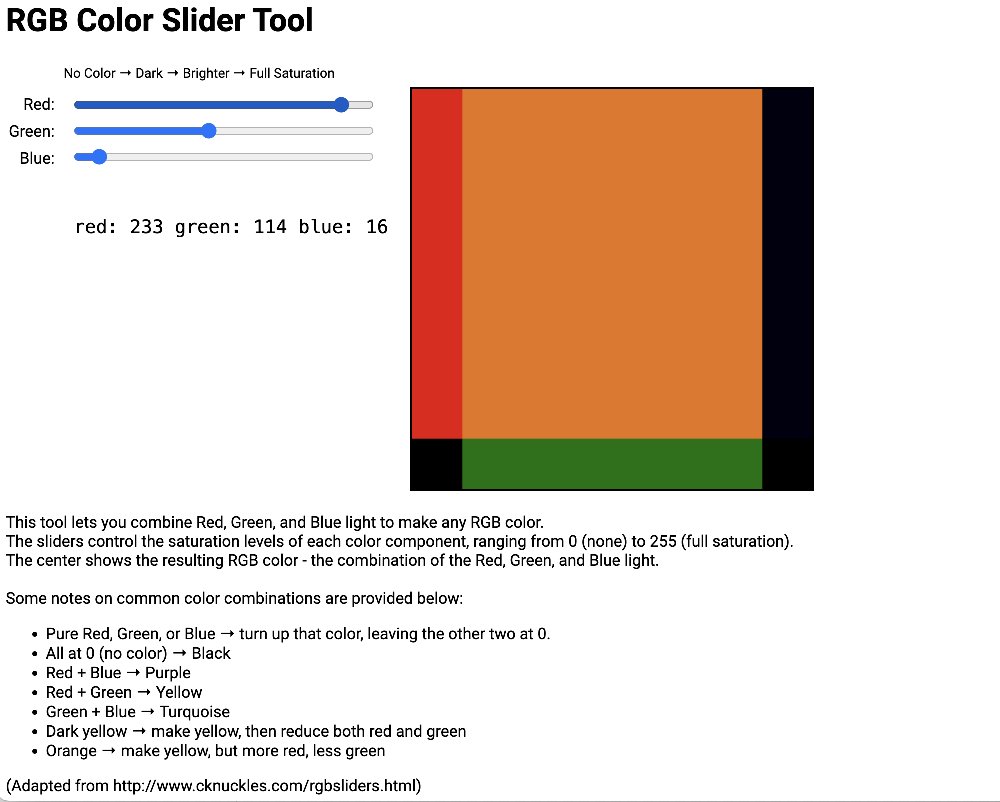
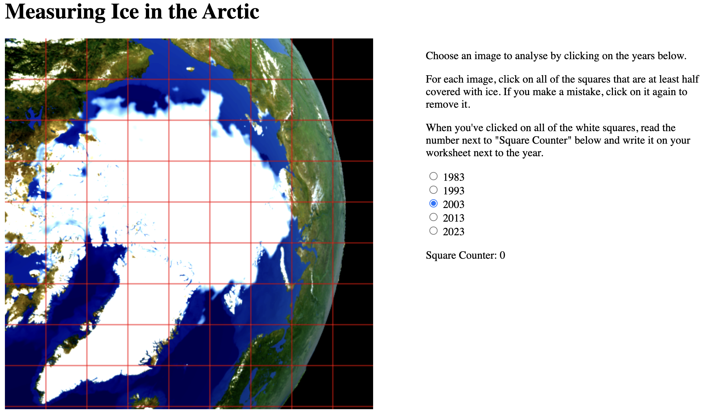

# image-analysis-outreach
A collection of materials and information for school outreach sessions about image analysis

## Activity 1
Link: [Colour Slider](https://xdl.github.io/rgb-colour-slider/ "Colour Slider")
### Instructions

## Activity 2
Link: [Arctic ice measurement](https://franciscrickinstitute.github.io/image-analysis-grid/ "Arctic Ice measurement")
### Instructions

